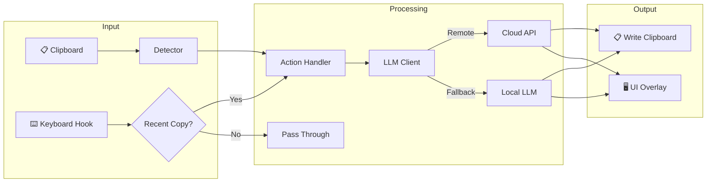
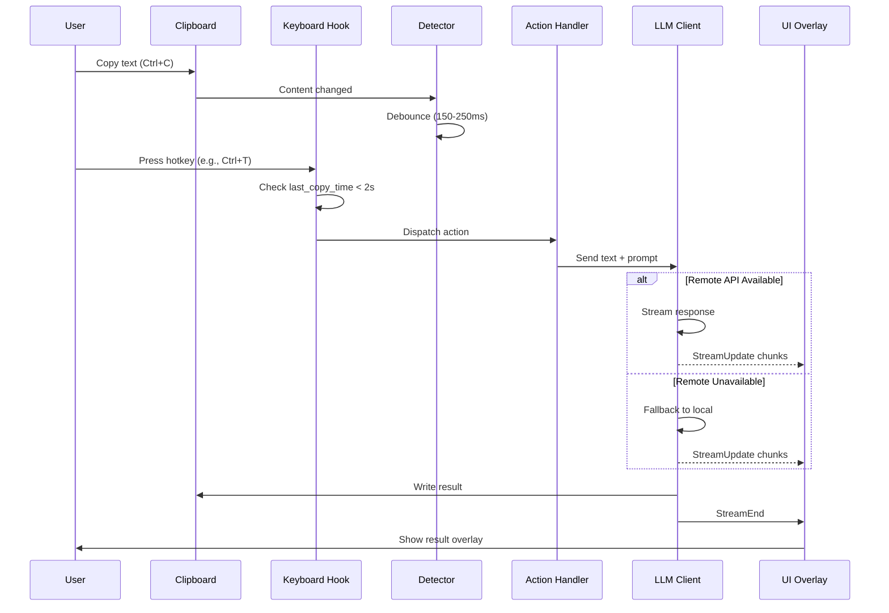
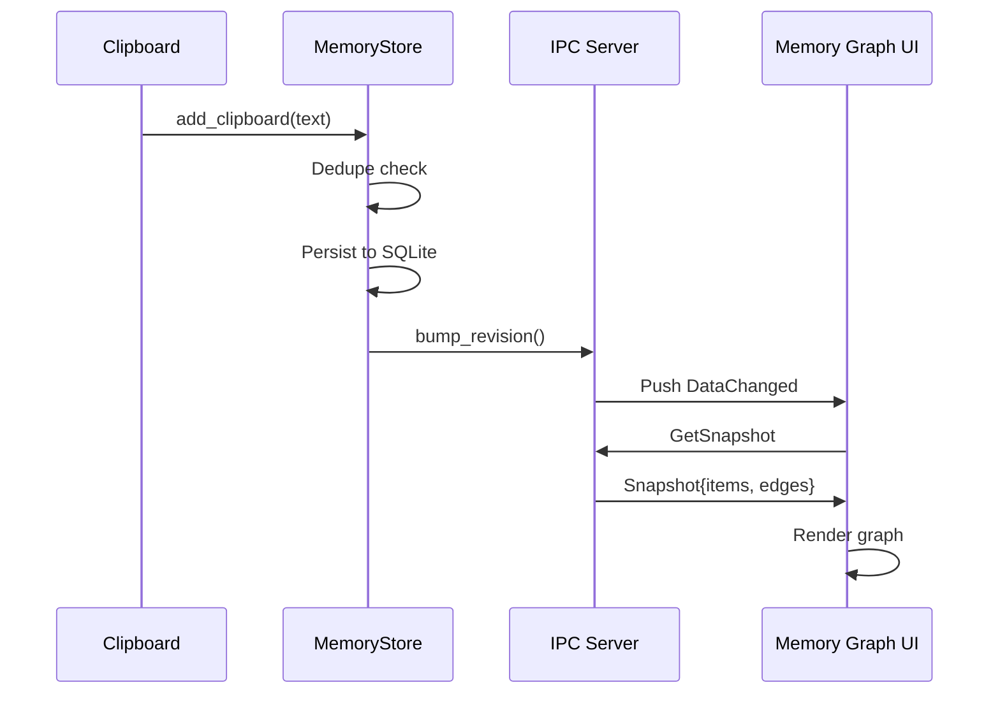
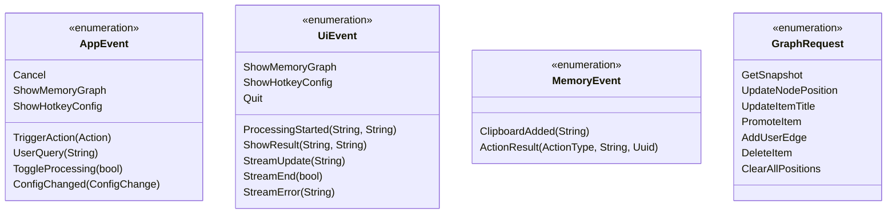
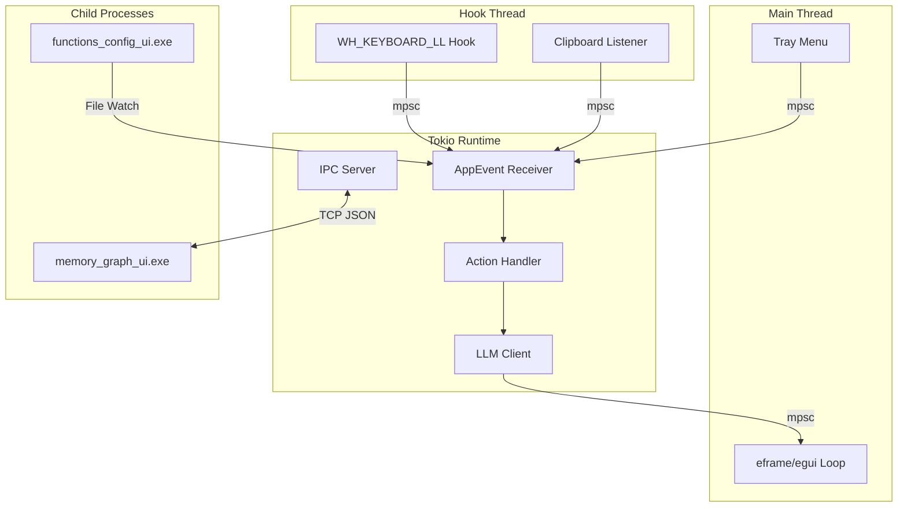
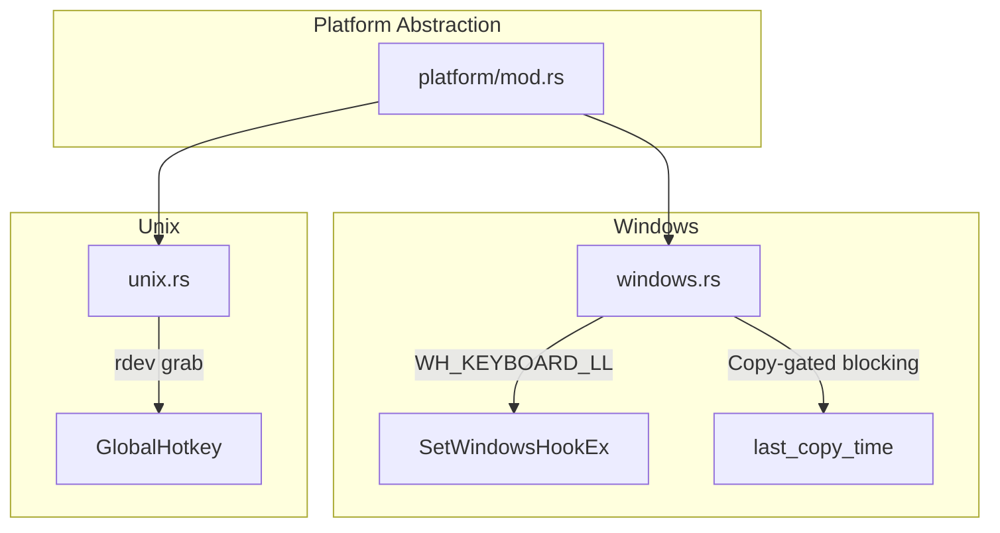
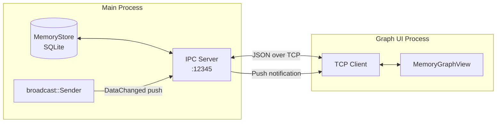
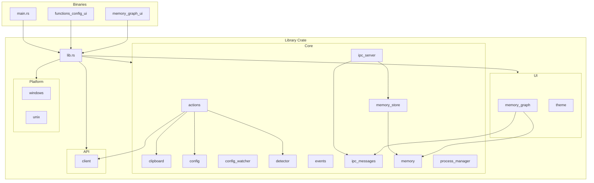
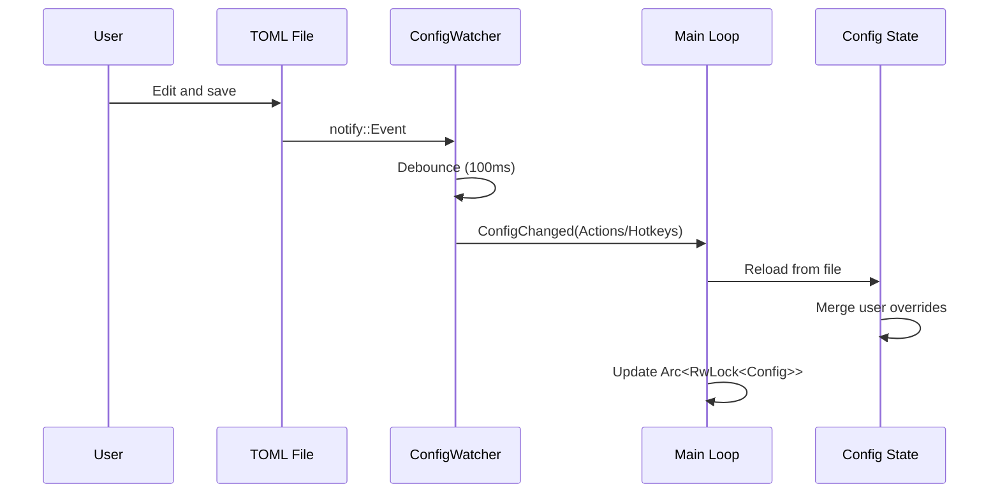

# IntelliBoard Architecture

This document provides a comprehensive overview of IntelliBoard's architecture, including data flow diagrams, component relationships, and the complete project structure.

## Table of Contents

- [High-Level Overview](#high-level-overview)
- [Data Flow](#data-flow)
- [Event System](#event-system)
- [Component Architecture](#component-architecture)
- [IPC Architecture](#ipc-architecture)
- [Project Structure](#project-structure)
- [Module Dependency Graph](#module-dependency-graph)

---

## High-Level Overview

IntelliBoard is a Rust desktop agent that enhances clipboard workflows using LLMs. The application runs as a system tray icon with a low-level keyboard hook that intercepts hotkeys only when clipboard content is available for processing.



---

## Data Flow

### Clipboard Processing Pipeline



### Memory System Flow



---

## Event System

IntelliBoard uses a multi-channel event system for communication between components.

### Event Types



### Channel Architecture



---

## Component Architecture

### Core Components

| Component | File | Responsibility |
|-----------|------|----------------|
| **Entry Point** | `main.rs` | Single-instance guard, tray setup, runtime bridge |
| **UI Overlay** | `ui.rs` | eframe app, UiEvent state machine, result display |
| **Action Handler** | `core/actions.rs` | Orchestrates Detector → LLM → Clipboard flow |
| **LLM Client** | `api/client.rs` | Remote/local API calls, streaming, fallback |
| **Detector** | `core/detector.rs` | Regex/heuristics for text classification |
| **Clipboard** | `core/clipboard.rs` | arboard wrapper, IME-aware debouncing |
| **Memory Store** | `core/memory_store.rs` | SQLite-backed clipboard history |
| **Config** | `core/config.rs` | TOML loading, hot-reload, user overrides |
| **IPC Server** | `core/ipc_server.rs` | TCP server for Memory Graph UI |
| **Process Manager** | `core/process_manager.rs` | Child process spawning/cleanup |

### Platform Layer



---

## IPC Architecture

### Memory Graph Communication



### IPC Protocol

| Request | Response | Description |
|---------|----------|-------------|
| `GetSnapshot` | `Snapshot{items, edges}` | Fetch all memory items and edges |
| `UpdateNodePosition{id, x, y}` | `Snapshot` | Move node, persist position |
| `UpdateItemTitle{id, title}` | `Snapshot` | Rename item |
| `PromoteItem{id, target_type}` | `Snapshot` | Promote to Mid/Long-term |
| `AddUserEdge{source, target}` | `Snapshot` | Create user-defined link |
| `DeleteItem{id}` | `Snapshot` | Delete item and orphan edges |
| `ClearAllPositions` | `Snapshot` | Reset all node positions (Auto Align) |

---

## Project Structure

```
IntelliBoard/
├── 📄 Cargo.toml              # Dependencies and build config
├── 📄 build.rs                # Icon embedding, config copy
├── 📄 README.md               # User documentation
├── 📄 LICENSE                 # License file
├── 📄 DISTRIBUTION.md         # Distribution guidelines
│
├── 📁 config/                 # Default configuration files
│   ├── actions.toml           # AI action definitions
│   ├── hotkeys.toml           # Hotkey bindings
│   └── commands.toml          # Custom tray commands
│
├── 📁 docs/                   # Documentation
│   └── ARCHITECTURE.md        # This file
│
├── 📁 resources/              # Static resources
│   └── icon.png               # Application icon
│
├── 📁 src/
│   ├── 📄 main.rs             # Entry point, tray, runtime bridge
│   ├── 📄 lib.rs              # Library crate root
│   ├── 📄 startup.rs          # Platform-agnostic initialization
│   ├── 📄 ui.rs               # Main UI overlay (eframe app)
│   │
│   ├── 📁 api/                # External API clients
│   │   ├── mod.rs
│   │   └── client.rs          # LLM client with streaming
│   │
│   ├── 📁 core/               # Core business logic
│   │   ├── mod.rs
│   │   ├── actions.rs         # Action handler orchestration
│   │   ├── clipboard.rs       # Clipboard with debouncing
│   │   ├── clipboard_listener.rs  # arboard integration
│   │   ├── config.rs          # Config types and loaders
│   │   ├── config_watcher.rs  # Hot-reload via notify
│   │   ├── detector.rs        # Text classification heuristics
│   │   ├── events.rs          # AppEvent, MemoryEvent enums
│   │   ├── ipc_messages.rs    # GraphRequest/Response types
│   │   ├── ipc_server.rs      # TCP server for Graph UI
│   │   ├── memory.rs          # MemoryItem, MemoryEdge types
│   │   ├── memory_store.rs    # SQLite persistence layer
│   │   └── process_manager.rs # Child process management
│   │
│   ├── 📁 platform/           # Platform-specific code
│   │   ├── mod.rs             # Conditional compilation
│   │   ├── windows.rs         # WH_KEYBOARD_LL hook
│   │   └── unix.rs            # rdev-based hotkeys
│   │
│   ├── 📁 ui/                 # UI components
│   │   ├── memory_graph.rs    # Visual graph rendering
│   │   ├── hotkey_config.rs   # (Legacy) hotkey editor
│   │   └── theme.rs           # "Japan 2046" theme
│   │
│   └── 📁 bin/                # Standalone executables
│       ├── functions_config_ui.rs  # Config editor window
│       ├── hotkey_config_ui.rs     # (Legacy) hotkey editor
│       └── memory_graph_ui.rs      # Memory graph viewer
│
├── 📁 logs/                   # Runtime log files
├── 📁 tests/                  # Test suite
│   └── integration/           # Integration tests (TODO)
│
└── 📁 target/                 # Build output
    └── release/
        ├── IntelliBoard.exe
        ├── functions_config_ui.exe
        └── memory_graph_ui.exe
```

---

## Module Dependency Graph



---

## Key Patterns

### Shared State

| Pattern | Usage | Location |
|---------|-------|----------|
| `Arc<Mutex<T>>` | Tray handler, UI state | `ui.rs`, `main.rs` |
| `Arc<RwLock<T>>` | Hot-reloadable configs | `config.rs` |
| `Arc<AtomicBool>` | Processing flags | `actions.rs` |
| `Arc<MemoryStore>` | Clipboard history | `memory_store.rs` |

### Async Patterns

| Pattern | Usage | Location |
|---------|-------|----------|
| `tokio::spawn` | Background tasks | `main.rs`, `ipc_server.rs` |
| `tokio::select!` | Event multiplexing | `main.rs`, `handle_client` |
| `tokio::sync::mpsc` | Cross-thread messaging | UI events, app events |
| `tokio::sync::broadcast` | Push notifications | IPC server |
| `tokio::sync::OnceCell` | Lazy initialization | LLM client |

### Error Handling

| Pattern | Usage |
|---------|-------|
| `anyhow::Result` | Top-level error propagation |
| `log::error!` + continue | Non-fatal errors in loops |
| Lock poison recovery | `RwLock`/`Mutex` in `memory_store.rs` |

---

## Configuration Hot-Reload



---

## See Also

- [README.md](../README.md) - User documentation
- [.github/copilot-instructions.md](../.github/copilot-instructions.md) - AI coding agent guidelines
- [config/actions.toml](../config/actions.toml) - Action configuration reference
